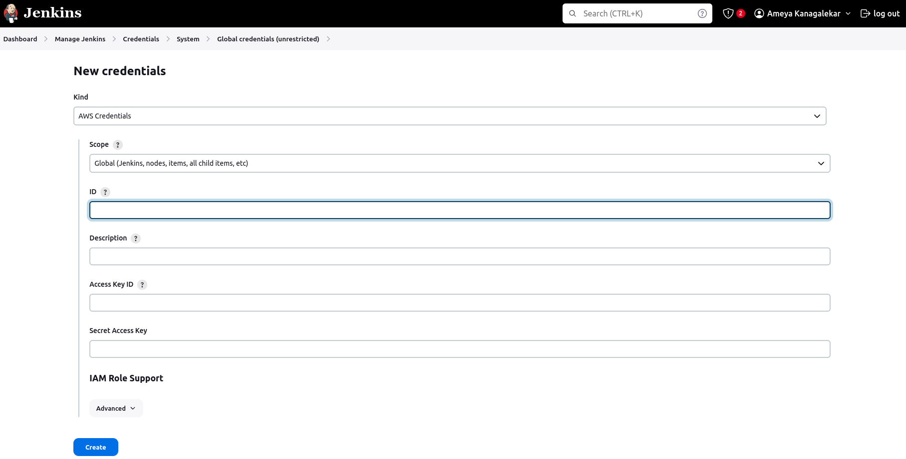

# Project-1 SAVii

## Part 1: Setup Jenkins in Docker Container

After installing docker on local machine use the following command to set jenkins up:

```bash
docker pull jenkins/jenkins:lts
```

```bash
docker run -d -p 8080:8080 -p 50000:50000 -v jenkins_home:/var/jenkins_home jenkins/jenkins:lts
```

To access and setup jenkins locally go to a browser and follow this url : http://localhost:8080


## Part 2: Kubernetes

After installing minikube and kubectl (from the website)

```bash
minikube start
```

```bash
kubectl apply -f deployment.yaml
```

To get details about the deployment: 
```bash
kubectl  describe deployments --namespace=default
```
Apply service:
```bash
kubectl apply -f service.yaml
```
To access jenkins get the url using this command :
```bash
minikube service jenkins-service --url
```
To check running pods:
```bash
kubectl get pods
```

Now to get inital admin password you can do 2 things:
1) `` kubectl exec <pod-name> cat /var/jenkins_home/secrets/initialAdminPassword ``
2) `` kubectl logs <pod-name> ``

then setup plugins according to your need

some important ones --> git,docker, kubernetes, aws credentials,terraform, blue ocean, build timeout, ssh, timestamps etc. 

## Part 3: Configure Jenkins Pipeline

Using the same jenkins pod running on your kubernetes cluster setup AWS credentials:




1) Go to AWS management console as root user and go to -> IAM -> Users -> Create User 
2) Create User with Programmatic access and click on next -> create permmissions policy and use the following json file :
```json
{
    "Version": "2012-10-17",
    "Statement": [
        {
            "Sid": "Stmt1312295543082",
            "Action": [
                "ec2:DescribeSpotInstanceRequests",
                "ec2:CancelSpotInstanceRequests",
                "ec2:GetConsoleOutput",
                "ec2:RequestSpotInstances",
                "ec2:RunInstances",
                "ec2:StartInstances",
                "ec2:StopInstances",
                "ec2:TerminateInstances",
                "ec2:CreateTags",
                "ec2:DeleteTags",
                "ec2:DescribeInstances",
                "ec2:DescribeInstanceTypes",
                "ec2:DescribeKeyPairs",
                "ec2:DescribeRegions",
                "ec2:DescribeImages",
                "ec2:DescribeAvailabilityZones",
                "ec2:DescribeSecurityGroups",
                "ec2:DescribeSubnets",
                "iam:ListInstanceProfilesForRole",
                "iam:PassRole",
                "ec2:GetPasswordData"
            ],
            "Effect": "Allow",
            "Resource": "*"
        }
    ]
}
```

3) finally review and create the IAM user
4) Now Navigate to IAM -> Users -> jenkins-user -> Security Credentials
5) Create access-key and retrieve access-key-id and Secret Access Key 
6) Enter them in Jenkins and setup your AWS creds in jenkins 

**Write Jenkinsfile**
First init a repo with this code and push in github
1) Create a new repository on your remote github 
2) setup your local repo
```bash 
git init 
git remote add origin <repo-url>
git branch -M main
git add . 
git commit -m "feat: Init commit"
git push origin main
```
to check remote and status and logs for commit history use following commands
```bash
git log --oneline
git remote -v
git status
```
